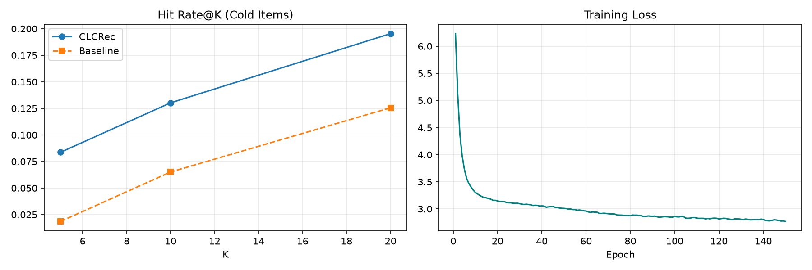

# FirstSlot (لانچ‌اسلات)


**The first-impression engine for zero-sale items.**

A new SKU is either buried until it sells, or sprayed in a “new arrivals” dump. FirstSlot treats those first impressions as a **scarce launch budget**: encode the item from specs (CLCRec-style contrastive alignment), pick the accounts that will buy *and* yield a clean collaborative signal, and tell merchandising which warm SKU to sit next to.

That is the industrial gap. MovieLens HR@K is the research core underneath, not the product.

Persian sell sheet for a professor taking this to a plant / distributor: [`commercial/PROPOSAL_FA.md`](commercial/PROPOSAL_FA.md).

```bash
python main.py --product
python main.py --serve          # open http://127.0.0.1:8080
```

---

## Product loop

1. Catalog + purchase history (demo: Iranian-style MRO plants and part families).
2. SVD on **warm** SKUs only — no leakage from the item being launched.
3. Content encoder maps specs → that space (InfoNCE).
4. FirstSlot allocates the first *B* impressions with a diversity penalty across plant industries.
5. KPI a buyer understands: **precision of the first B impressions** vs random spray and “heavy buyers of the same category”.

## What a lab actually gets

| Capability | Why it matters in a defense or an industry meeting |
|---|---|
| Leakage guard | Cold-item interactions are **excluded from SVD** |
| Academic protocol | User vector = mean of **warm** history; report cold-pool and full ranking |
| Baselines | Raw content **and** a ridge map (constraint-style, CB2CF family) |
| Uncertainty | Bootstrap 95% intervals on HR / Recall / NDCG |
| New-item API | Title + genres + year → neighbors, no retraining |
| HTTP service | `POST /v1/new_item` for a live demo |
| Transparent math | Forward, backward, and Adam are hand-written NumPy |

This is **not** a drop-in clone of the official multimodal CLCRec release (ResNet / VGGish / Sentence2Vec on TikTok–Kwai–Amazon). It is a lab-grade R–E contrastive core that a graduate course can read line by line, then extend.

---

## Results

### Legacy protocol (original demo)

Evaluated on users with cold-item interactions (MovieLens-1M). Candidate pool = cold items only. Content = genre + year. **This protocol is kept only so the first public table stays reproducible.**

| Model    | HR@5   | HR@10  | HR@20  | NDCG@10 |
|----------|--------|--------|--------|---------|
| Baseline | 0.0186 | 0.0651 | 0.1256 | 0.0228  |
| CLCRec   | 0.0837 | 0.1302 | 0.1953 | 0.0474  |

```bash
python main.py --protocol legacy --no-title
```

### Academic protocol (default — use this in a meeting)

- Collaborative SVD is fit on **warm items only**
- User embedding uses **warm history only**
- Metrics: HR, Recall, NDCG with bootstrap intervals
- Compared against Raw-Content and Ridge-Map
- Optional title TF–IDF (Truncated SVD) is on by default

```bash
python main.py --protocol academic
```

Numbers change versus the legacy table: the task is harder and the split is honest. That is intentional.

### Visualization

The committed `results.png` is from the legacy demo (150 epochs, `HIDDEN_DIM=32`, `L2_REG=5e-4`). A new run writes both `results.png` and `artifacts/results.png`.



---

## Quick start

```bash
python3.12 -m venv .venv
source .venv/bin/activate
pip install -r requirements.txt
python main.py --product
python main.py --serve
```

MovieLens research run:

```bash
python main.py --protocol academic
python main.py --protocol legacy --no-title
python main.py --demo-new-item --title "Dune (2021)" --genres "Action|Adventure|Sci-Fi"
python main.py --serve          # http://0.0.0.0:8080
python -m unittest tests.test_lab_kit
```

HTTP after artifacts exist:

```http
POST /v1/similar      {"item_id": 1, "k": 10}
POST /v1/recommend    {"user_id": 1, "k": 10, "pool": "cold"}
POST /v1/new_item     {"title": "Dune (2021)", "genres": "Action|Sci-Fi", "k": 10}
GET  /v1/health
```

---

## Architecture

```
Content (genre + year [+ title])
        |
        v
  [Linear + ReLU]          Collaborative embeddings (SVD on WARM items only)
        |                            |
        v                            |
  [Linear + L2-Norm]                 |
        |                            |
        +-------- InfoNCE (R–E) -----+
```

At inference, recommendations are cosine similarity between a user vector (mean of liked **warm** items) and content-encoded items — including items that never appeared in SVD.

---

## Project structure

```
clcrec-cold-start/
├── main.py
├── requirements.txt
├── LICENSE                      # evaluation vs institutional use
├── commercial/PROPOSAL_FA.md    # professor → industry sell sheet
├── dashboard/                   # FirstSlot merchant UI
├── artifacts/                   # encoder, catalog, metrics (created at run)
├── tests/
└── src/
    ├── config.py
    ├── dataset.py               # download, featurizer, leakage-safe SVD
    ├── model.py                 # encoder + InfoNCE + save/load
    ├── train.py                 # Adam loop, validation early stop
    ├── baselines.py             # raw content, ridge map
    ├── evaluate.py              # legacy + academic metrics
    ├── recommend.py             # lab / industry inference API
    ├── experiment.py            # MovieLens reproducible run
    ├── mro.py                   # industrial demo catalog
    ├── launch.py                # FirstSlot allocation + launch KPI
    ├── product.py               # train the sellable vertical
    └── serve.py                 # UI + HTTP
```

---

## Hyperparameters

Defaults live in `src/config.py` and can be overridden from `main.py`:

| Parameter | Default | Description |
|-----------|---------|-------------|
| `emb_dim` | 32 | SVD and encoder width |
| `hidden_dim` | 32 | MLP hidden size |
| `cold_threshold` | 10 | Frequency split (unless `cold_ratio` is set) |
| `epochs` | 150 | Max epochs (early stopping on warm val loss) |
| `batch_size` | 256 | Warm-item batch |
| `lr` | 0.005 | Adam |
| `tau` | 0.1 | InfoNCE temperature |
| `l2_reg` | 5e-4 | Weight decay |
| `patience` | 20 | Early stopping |
| `n_test_users` | 1000 | Users sampled for the table |
| `use_title` | True | Title TF–IDF + SVD |
| `protocol` | academic | `academic` or `legacy` |
| `seed` | 42 | RNG |

Paper-style random item hold-out:

```bash
python main.py --cold-ratio 0.2
```

---

## Evaluation protocols

**Legacy.** Same as the first public README: candidate pool is all cold items; user vector excludes ground-truth cold items but may still include other cold likes; SVD historically saw those interactions. Kept for the published HR table.

**Academic (default).** Matches the scientific claim of *complete* item cold-start more closely:

1. Draw warm / cold by frequency or by `--cold-ratio`
2. Fit SVD **without** cold columns
3. Train the encoder only on warm items
4. Build each test user from warm likes
5. Score cold-pool ranking **and** full-catalog ranking of cold ground truth
6. Report HR / Recall / NDCG with bootstrap intervals

Official CLCRec also uses a random cold hold-out, full ranking, and extra U–I contrastive terms on multimodal features. Those extensions are listed as thesis topics in the commercial proposal.

---

## Python API

```python
from src.recommend import ColdStartRecommender

rec = ColdStartRecommender.load("artifacts")
rec.similar_items(1, k=10)
rec.recommend_user(1, k=10, pool="cold")
rec.recommend_for_new_item("Dune", "Action|Adventure|Sci-Fi", year=2021)
```

---

## Tests

```bash
python -m unittest tests.test_lab_kit
```

The suite covers encoder save/load, InfoNCE, leakage-safe SVD, the featurizer, a short train + academic table, and the recommender API. It does not download MovieLens.

---

## License and commercial use

Personal technical evaluation of this clone is allowed for 30 days. Teaching, lab-wide use, grant text, or industry work requires a license.

Three packages are specified for an industrial-university professor in [`commercial/PROPOSAL_FA.md`](commercial/PROPOSAL_FA.md):

1. Lab license (course / group use + transfer session)
2. 12-week research collaboration (paper / thesis)
3. University–industry contract (ارتباط با صنعت)

Contact: see the license file.

---

## References

- Harper, F. M., & Konstan, J. A. (2015). The MovieLens Datasets.
- Oord, A. van den, et al. (2018). Representation Learning with Contrastive Predictive Coding.
- Wei, W., et al. (2021). Contrastive Learning for Cold-Start Recommendation. ACM MM.  
  Official code: https://github.com/weiyinwei/CLCRec
